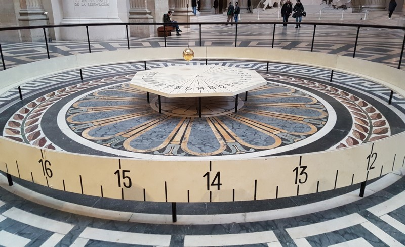
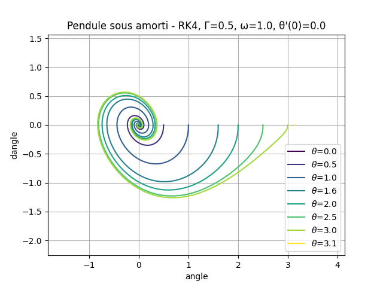

# Bureau d'études Python - Pendule de Foucault

Ce projet propose une simulation du pendule de Foucault, conçu pour étudier les effets de la rotation de la Terre à travers le mouvement d'un pendule. Cette simulation permet également de visualiser le diagramme des phases pour l'oscillateur harmonique.

## Contexte historique

En 1851, Jean Foucault a réalisé une expérience avec un pendule, démontrant la rotation de la Terre. Le pendule original était constitué d’un fil d’acier de 67 mètres de longueur et d'une boule de 28 kg. Les oscillations de ce pendule révèlent la rotation terrestre par un changement progressif de la direction du plan d'oscillation, qui dépend également de la latitude.



Pour plus d'informations sur l'expérience de Foucault, vous pouvez consulter cette [vidéo](https://www.youtube.com/watch?v=zO0dg4a_70o&lc=UgzDaQFPSA9_FA_wmXN4AaABAg) ou la page [Wikipédia sur le pendule simple](https://fr.wikipedia.org/wiki/Pendule_simple#Plan_de_phase).

## Installation

Assurez-vous d'avoir Python 3 installé sur votre machine.

Pour installer les dépendances nécessaires, exécutez la commande suivante dans votre terminal :

```bash
pip install -r requirements.txt
```

## Utilisation

Pour démarrer la simulation, naviguez vers le répertoire du projet et exécutez :

```bash
python3 be.py
```

### Interactions disponibles

Le programme vous invitera à entrer plusieurs paramètres pour la simulation :

- **Γ (Coefficient de frottement)** : ce paramètre représente le frottement ou la résistance du milieu.
- **ω (Vitesse angulaire)** : indique la vitesse angulaire initiale.
- **θ'(0) (Vitesse angulaire initiale à t=0)** : valeur initiale de la vitesse angulaire du pendule.
- **Méthode de résolution numérique** : choisissez 'r' pour l'approche Runge-Kutta de quatrième ordre (rk4) ou 'e' pour Euler pour l'intégration numérique.

Chaque paramètre influencera la simulation du pendule, et vous pourrez visualiser les résultats directement après avoir entré ces informations.

## Résultats de simulation




### Pourquoi y a-t-il des spirales qui convergent au centre ?
Les spirales représentent le comportement d'un pendule sous l'effet de frottements, qui est dit "sous-amorti". Dans ce cas, le pendule ne se balance pas indéfiniment avec la même amplitude. Au lieu de cela, à chaque oscillation, le pendule perd un peu d'énergie à cause des forces de frottement (comme l'air ou la friction au point de pivot), ce qui réduit progressivement l'amplitude de ses oscillations. La convergence vers le centre du graphique montre que le pendule se rapproche de sa position d'équilibre (où il serait complètement immobile), ce qui se traduit par un angle et une vitesse angulaire qui tendent vers zéro.

### Lien avec la démonstration de la rotation de la terre
Le pendule de Foucault, en réalité, est utilisé pour démontrer la rotation de la Terre. Lorsque le pendule oscille librement, il conserve son plan d'oscillation initial grâce à la loi de conservation du moment angulaire. Cependant, comme la Terre tourne sous le pendule, le plan d'oscillation semble tourner lentement. À différents endroits sur la Terre, cette rotation a différentes vitesses angulaires, ce qui peut être calculé et observé.

### Notes de fin
Pour faire le lien avec la rotation de la Terre en utilisant un pendule simulé comme celui-ci, on pourrait analyser non seulement comment le pendule se calme, mais aussi comment son plan d'oscillation se déplace au fil du temps si le modèle simulait également l'effet de la rotation terrestre. En ajoutant cet aspect, les spirales sur le diagramme de phase pourraient aussi commencer à illustrer non seulement la perte d'énergie mais aussi le changement graduel du plan d'oscillation due à la rotation de la Terre.


## Repos source
Base: https://github.com/gwendalauphan/BE_python.git


